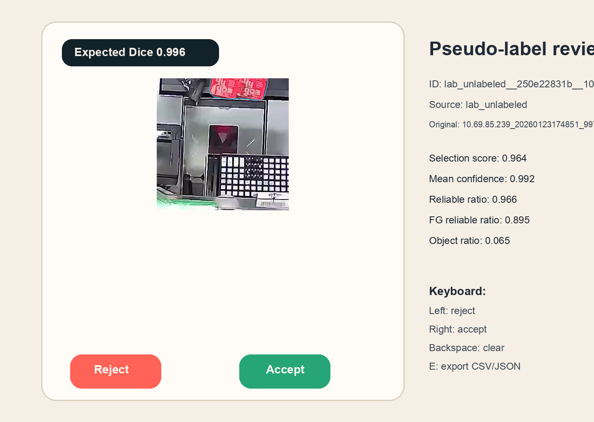
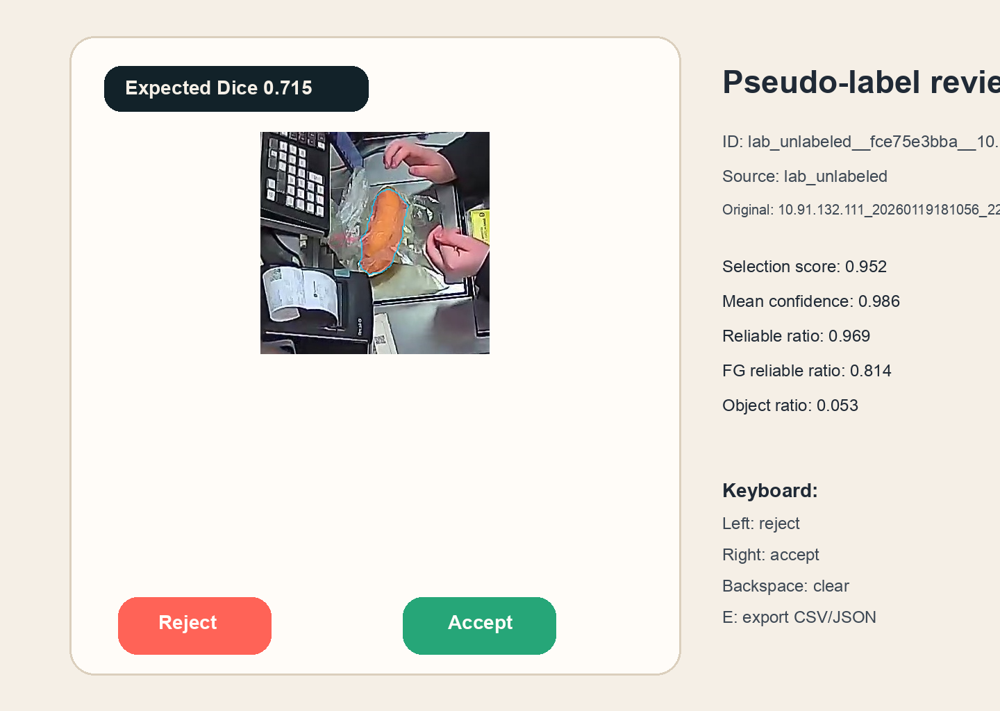

# Object Segmentation Lab

End-to-end exploration of binary product segmentation for a lab assignment: classic supervised baselines, a stronger SegFormer supervision track, semi-supervised pseudo-labeling experiments, and a DINOv2 proxy-research line.

The repository is intentionally GitHub-friendly:

- code, docs, sanitized benchmark metadata, and lightweight previews are versioned;
- raw datasets, checkpoints, caches, Docker exports, and full training artifacts stay outside Git;
- generated documentation is rebuilt from publish-safe metadata before push.

## Highlights

<!-- AUTO-GENERATED:BENCHMARK_SNAPSHOT_START -->
- **Safest reproducible path**: `Advanced Baseline` with OOF Dice 0.8391. Grouped-by-camera 3-fold ensemble with EMA, threshold tuning, and TTA.
- **Strongest supervised signal**: `Supervised V4` with dice_tuned 0.8959. segformer_b2_fold1_384_finetune_from_moderate
- **Best semi-supervised local result**: `SegFormer Boundary Semi-Supervised` with val_mIoU 0.9047. Iteration 0 improved over the supervised phase, iteration 1 regressed.
- **Best proxy-research result**: `DINOv2 Research` with best_val_iou 0.7224. concat fusion on dinov2_s.

| Track | Status | Headline metric | Quick entrypoint |
| --- | --- | --- | --- |
| Advanced Baseline | working | OOF Dice 0.8391 | `python scripts/run_lab3_ensemble_submission.py --limit 5` |
| Supervised V4 | working | dice_tuned 0.8959 | `python scripts/predict_supervised_v4_ensemble.py --preset wide6 --limit 5` |
| SegFormer Boundary Semi-Supervised | research | val_mIoU 0.9047 | `python scripts/run_segformer_semisup_smoke_test.py` |
| DINOv2 Research | research | best_val_iou 0.7224 | `python scripts/run_dinov2_smoke_test.py --overwrite-cache` |
<!-- AUTO-GENERATED:BENCHMARK_SNAPSHOT_END -->

## Repository Map

- `src/lab_object_segmentation/` contains the reusable Python implementation.
- `scripts/` contains CLI entrypoints for training, inference, export, and documentation automation.
- `notebooks/` keeps the notebook-based baseline and research history.
- `artifacts/public/` stores sanitized benchmark metadata and selected preview assets that are safe to publish.
- `docs/` stores the public-facing narrative, generated registries, and archival notes.

## Reproducibility

The safest path to reproduce an existing result is the classic `advanced_baseline` ensemble:

```bash
python scripts/run_lab3_ensemble_submission.py --limit 5
```

The strongest supervised-only path is `supervised_v4`:

```bash
python scripts/predict_supervised_v4_ensemble.py --preset wide6 --limit 5
```

To inspect the available training configuration without launching a run:

```bash
python scripts/train_supervised_v4.py --help
python scripts/predict_supervised_v4_ensemble.py --help
python scripts/run_lab3_ensemble_submission.py --help
```

## Environment Setup

Install the CPU PyTorch wheels first, then the project dependencies:

```bash
python -m pip install --upgrade pip
pip install --extra-index-url https://download.pytorch.org/whl/cpu \
  torch==2.11.0 torchvision==0.26.0
pip install -r requirements.txt
```

Docker remains available for a portable notebook-oriented setup:

```bash
docker compose up --build
```

Optional Kaggle-backed sources can be pulled separately after the environment is ready:

```bash
python scripts/download_kaggle_sources.py
```

## Data Policy

The public repository does not ship raw datasets or model weights.

- `data/raw/` is expected to contain the downloaded lab datasets locally.
- `artifacts/runs/` holds local training outputs and full experiment artifacts.
- `artifacts/public/` holds the sanitized metadata layer that powers the README and experiment registry.

## Selected Visuals




## Documentation

- [Experiment registry](docs/experiment_registry.md)
- [Generated benchmark snapshot](docs/generated/benchmark_snapshot.json)
- [Generated experiment registry JSON](docs/generated/experiment_registry.json)
- [Russian deep dive](docs/project_deep_dive_ru.md)
- [Archive policy](docs/archive/README.md)

## Automation

Two local automation helpers keep the repository aligned with new experiments:

```bash
python scripts/export_public_results.py
python scripts/build_project_docs.py
```

Install the tracked Git hook once per clone to run them automatically before push:

```bash
bash scripts/install_git_hooks.sh
```
